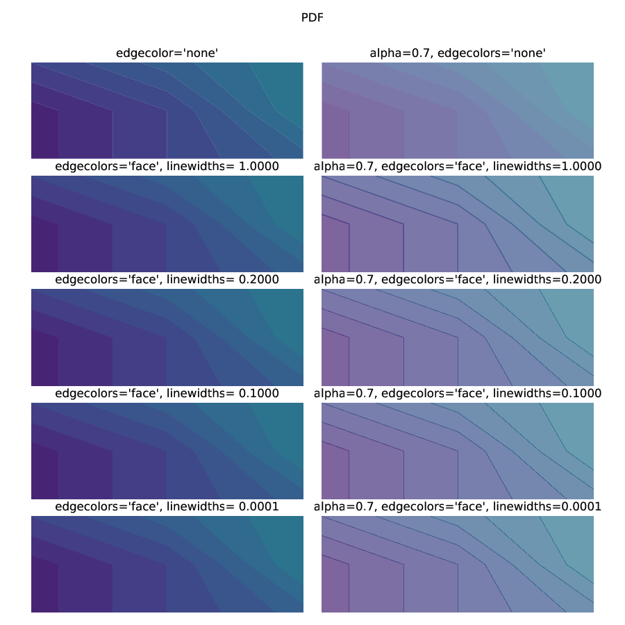

================================================================
Issues with contourf and pcolor and anti-aliasing in pdf viewers
================================================================

``contourf`` and ``pcolormesh`` can look bad in pdf viewers, with lots
of extra "gridlines" or lines around the boundaries of the contours.

.. figure:: exampleContour.pdf.png
   :alt: example contour.pdf

   This is an example contourf PDF converted to png at 100 dpi to mimic
   what a screen would show.

The same plot rendered by Matplotlib into a 100-dpi png does not have the
extra whitish dashed lines around each contour

.. figure:: exampleContour.png
   :alt: example contour.pdf

   This is an example contourf directly printed to a 100-dpi png.

The reason the pdf file renders like this is because the pdf rasterizer
will often employ anti-aliasing be default.  Software
when displaying the PDF will rasterize the polygons that make up the contours
and apply anti-aliasing to their edges.  However, this is usually done
per-polygon, so the first polygon with anti-aliasing doesn't know that
it is going to be beside another polygon, so it anti-aliases with the
white background of the figure.  The adjacent polygon does the same, and hence
the pixels at the boudnary between the two polygons are lightened.  The same
figure rendered with a black background yields dark lines between the
contours.

.. figure:: exampleContourBlack.pdf.png
   :alt: example contour.pdf

   This is an example contourf (converted to png at 100 dpi to mimic
   what a screen would show) but with the background black. Note that
   contour interfaces are now dark.

Note that at a fundamental level, this is *not* Matplotlib's fault.  If you
rasterize the PDF produced by matplotlib at 300 dpi (i.e. using
Imagemagick or another rasterizing tool), the anti-aliasing is
not as noticeable.  If you could turn anti-aliasing off for your
PDF viewer, this problem would not occur.

   This is an example contourf PDF converted to png at 300 dpi.

What to do?
===========

What should be done depends on your application.

Producing PDFs (and EPS, SVG)
-----------------------------

If you are producing PDF
files, setting the ``edgecolor='face'`` option in ``contourf`` and setting
the ``linewidths=0.2`` yields a good result on a 200-dpi monitor.  Of course
this means that the underlying polygons are now overlapping by 0.07 mm.
That is not too likely a problem for normal viewing, but if contours are
being zoomed in on to a very high level that will cause some distortion of the
exact boundaries.

If you are using alpha values in your contours, then there is a problem with
the overlapping, because now your alpha value is doubled, likely over 1.0.

   Countourf at different values of ``edgecolors`` and ``linewidths`` in a PDF
   converted to 100 dpi png for display here.  `Original pdf`__.

.. __: ./testcontour.pdf

Producing PNGs (and JPEG, etc)
------------------------------

Here, the right answer is to almost always just use ``edgecolors='none'``:

   Countourf at different values of ``edgecolors`` and ``linewidths`` in a PNG
   rendered at 100 dpi by Matplotlib  `Original png`__.

.. __: ./testcontour.png
