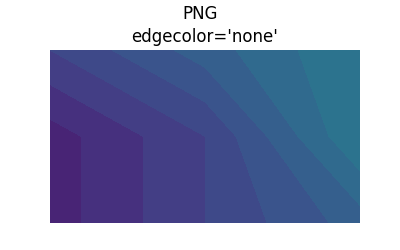

================================================================
Issues with contourf and pcolor and anti-aliasing in pdf viewers
================================================================

``contourf`` and ``pcolormesh`` can look bad in pdf viewers, with lots
of extra "gridlines" or lines around the boundaries of the contours.

   This is an example contourf (converted to png at 100 dpi to mimic
   what a screen would show).

The same plot rendered by Matplotlib into a 100-dpi png does not have the
extra whitish dashed lines around each contour

   This is an example contourf directly printed to a 100-dpi png.

The reason the pdf file renders like this is because the pdf rasterizer
will often employ anti-aliasing be default.  Software
when displaying the PDF will rasterize the polygons that make up the contours
and apply anti-aliasing to their edges.  However, this is usually done
per-polygon, so the first polygon with anti-aliasing doesn't know that
it is going to be beside another polygon, so it anti-aliases with the
white background of the figure.  The adjacent polygon does the same, and hence
the pixels at the boudnary between the two polygons are lightened.  The same
figure rendered with a black background yields dark lines between the
contours.

   This is an example contourf (converted to png at 100 dpi to mimic
   what a screen would show).
